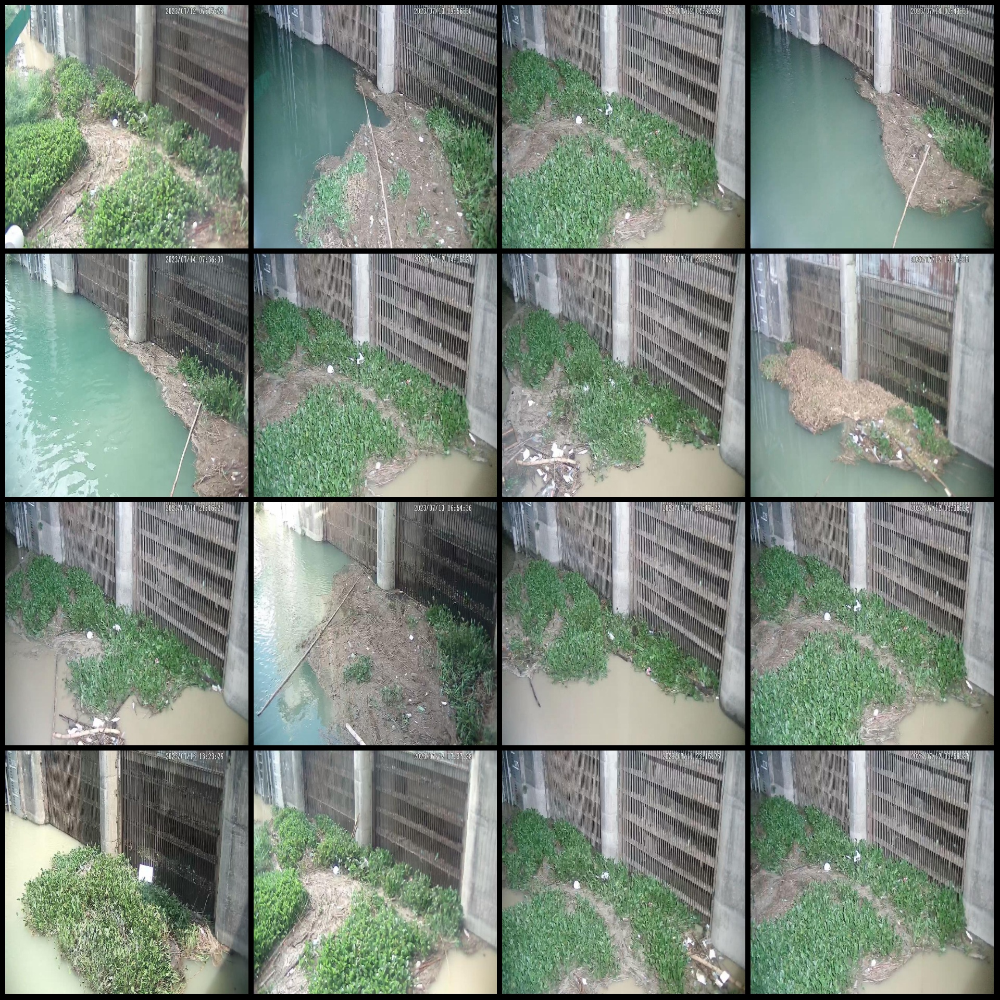
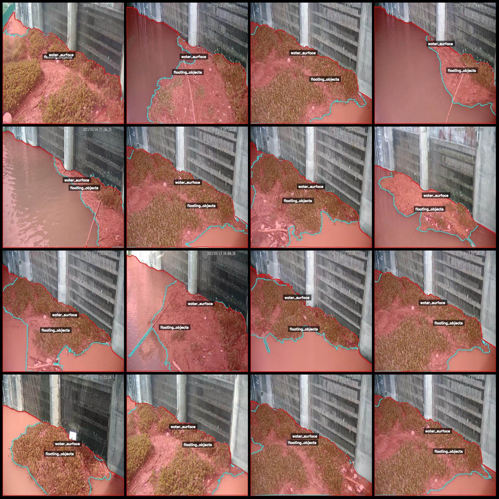
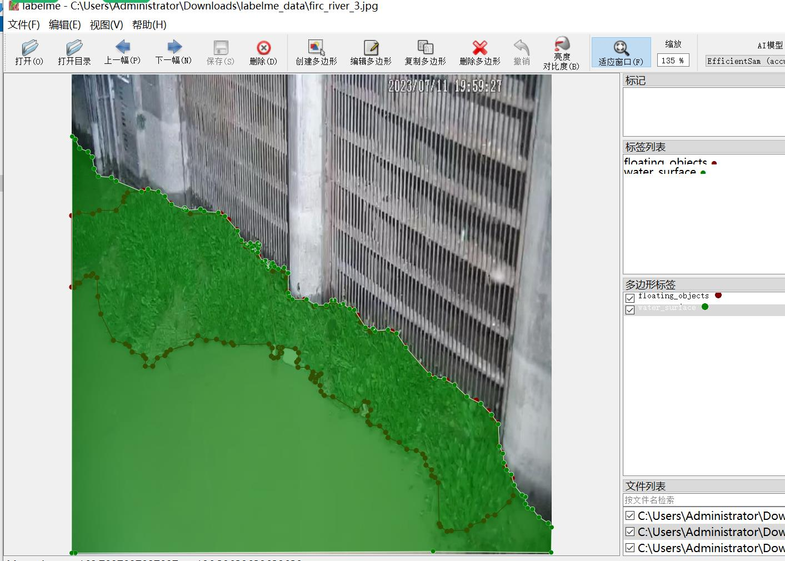

# Rivermouth Water Booster Floating Object Identification and Segmentation Dataset in labelme Format - 907 Images in 2 Classes

Please note that the dataset images are not enhanced, but they all come from the same river mouth at different time periods with floating objects gathering.
The dataset format: labelme format (excluding mask files, only including jpg images and corresponding json files).
Number of images (number of jpg files): 907
Number of labeled images (json file count): 907
Number of labeled categories: 2
Labeled categories: ["floating_objects", "water_surface"]
Number of boxes for each category:
- Number of floating objects (floating_objects) = 907
- Number of water surface (water_surface) = 907
Total number of boxes: 1814
Using labelme tool: labelme=5.5.0
Image resolution: 640x640
Annotation rules: Polygons are drawn around the categories.
Important Notice: The dataset can be opened and edited using labelme, but the json dataset needs to be converted into either mask or yolo or coco format for semantic segmentation or instance 
segmentation.
Special Disclaimer: This dataset does not guarantee any accuracy of the trained model or weight files.
Image Preview:
Annotation Example:
Randomly selected 16 images:
Annotation drawing results:
Labelme editing example image:

## Images

Here is a pay link on Stripe ( https://buy.stripe.com/3cs8yP7sY87d0vu9AB ). Please contact me lonlonago@foxmail.com after funding $89, and I will send you a complete data files , thank you!

